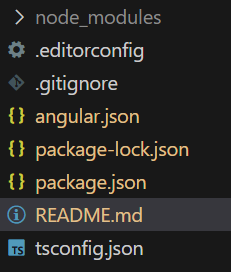
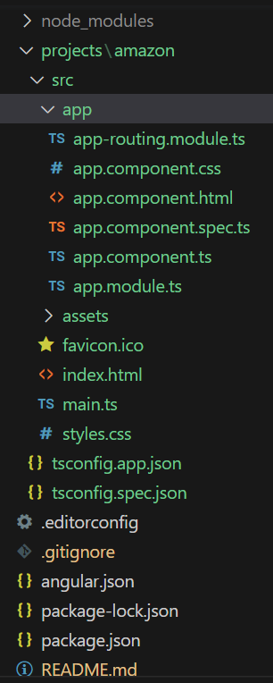

# Table Of Contents

- [Table Of Contents](#table-of-contents)
- [Setup Environment for Angular](#setup-environment-for-angular)
- [Setup Angular Workspace](#setup-angular-workspace)
- [Create a new Angular Application](#create-a-new-angular-application)
- [Setup Bootstrap CSS for Angular Application](#setup-bootstrap-css-for-angular-application)
- [Download and Use Fontawesome](#download-and-use-fontawesome)

# Setup Environment for Angular

1. Download and Install Node JS for "NPM"

   https://nodejs.org/en/download/

2. Download and Install Angular CLI, which is an command line tool used to manage your application.

   https://cli.angular.io/

- Open Your command prompt
- Type the following

  C:\> `npm install -g @angular/cli`

- Check the angular version after installing

  C:\> `ng --version`

- Update your CLI if it is using older version:

  C:\> `npm uninstall @angular/cli`

  C:\> `npm install @angular/cli`

  (or)

  C:\> `ng update`

  C:\> `ng update @angular/cli @angular/core --allow-dirty`

# Setup Angular Workspace

- To configure workspace run the following command.

  C:\> `ng new Your-Workspace-Name --create-application=false`

  

[🔙](#table-of-contents)

# Create a new Angular Application

1. Open Terminal
2. Change to your workspace folder
3. Type the following command

- C:\projects-workspace> `ng generate application your_app_name`
- C:\projects-workspace> `ng generate application amazon`

4. This will create a new folder "projects" in workspace and add "amazon" project in the folder.

5. To Start project of server

   > `ng serve --project=amazon`

- Your application starts of http://localhost:4200

[🔙](#table-of-contents)

# Setup Bootstrap CSS for Angular Application

- Download and Install Bootstrap for your Workspace.
- C:\your-workspace-name> `npm install bootstrap`

      ng-proj
      └─node_modules
          └───bootstrap
              └───dist
                    └───CSS
                          ├───bootstrap.css/bootstrap.min.css

- Go to "styles.css" file in "src" and import bootstrap.css

  `@import ../../../node_modules/bootstrap/dist/css/bootstrap.css`

[🔙](#table-of-contents)

# Download and Use Fontawesome

- Download "Fontawesome" Free for Web.

  https://fontawesome.com/download

- Extract and copy all files.
- Go to "node_modules" folder in file explore.
- Crate a sub folder by name "Fonts"
- Paste all fontawesome files into the sub folder.
- Import in "styles.css"

  `@import '../../../node_modules/Fonts/css/all.css`

[🔙](#table-of-contents)
